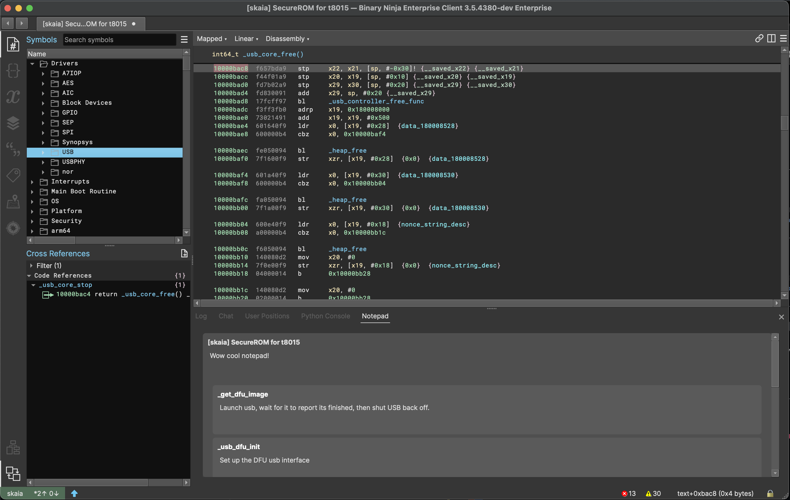

C++ Notepad plugin for BinaryNinja, supporting function/address specific notes
combined into a global pad per-binary.

---

 

---

WIP

---

 

plugin by cynder

part of the <a href="https://github.com/cxnder/ksuite">ksuite</a> toolkit

